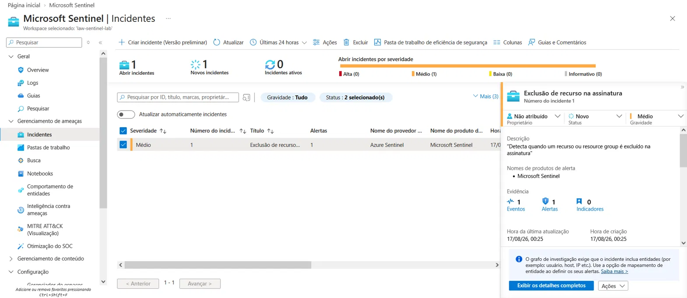
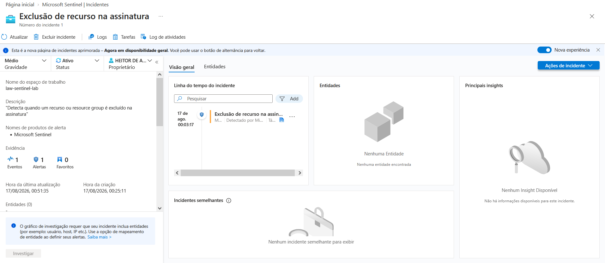
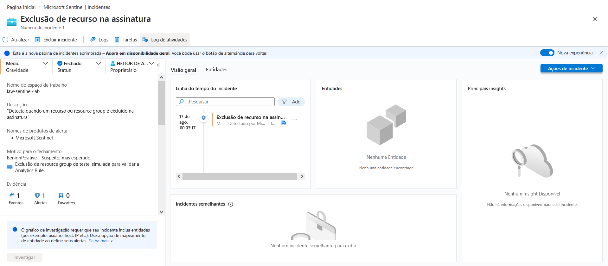

# 🛡️ Laboratório de Microsoft Sentinel — SIEM na prática

Laboratório pessoal de estudo de SIEM/SOC, construído na conta Azure for Students. O objetivo foi passar pelo ciclo completo de um SIEM: provisionamento → ingestão de logs → detecção → teste da detecção → visualização — documentando também os problemas reais encontrados no caminho (e não só o "final feliz").

## 🎯 Objetivo do laboratório

- Provisionar um workspace de Log Analytics e habilitar o Microsoft Sentinel
- Conectar uma fonte de dados real (Azure Activity Log) via Azure Policy
- Escrever queries KQL para exploração de logs
- Criar uma Analytics Rule de detecção e validar sua lógica com um evento real
- Construir um Workbook de visualização
- Gerenciar tudo dentro dos limites de custo de uma conta de estudante

## 🏗️ Arquitetura do laboratório

```
Assinatura Azure for Students
        │
        ▼
  Resource Group (rg-sentinel-lab)
        │
        ▼
  Log Analytics Workspace (law-sentinel-lab)
        │
        ▼
  Microsoft Sentinel habilitado
        │
        ├── Conector: Azure Activity (via Azure Policy - DeployIfNotExists)
        ├── Analytics Rule: "Exclusão de recurso na assinatura" (Severidade Média, MITRE: Impact)
        └── Workbook: Azure Activity (Top resource groups, atividades ao longo do tempo)
```

## 🔍 O que foi feito

### 1. Provisionamento do ambiente
- Criação do Resource Group `rg-sentinel-lab`
- Criação do Log Analytics Workspace `law-sentinel-lab`
- Habilitação do Microsoft Sentinel sobre o workspace
- Configuração de um alerta de orçamento no Cost Management, para acompanhar o consumo do crédito de estudante

### 2. Ingestão de dados — conector Azure Activity
O conector Azure Activity não fica ativo apenas ao ser "instalado" pelo Hub de Conteúdo — foi necessário configurá-lo via um **assistente de atribuição de Azure Policy** (efeito `DeployIfNotExists`), que cria a configuração de diagnóstico responsável por enviar os logs da assinatura para o workspace.

**Problema encontrado:** na primeira tentativa, o escopo da política foi definido incorretamente no nível do Resource Group (`rg-sentinel-lab`) em vez da assinatura inteira. Como o Log de Atividades é um recurso em nível de assinatura, a política nunca encontrou um recurso aplicável (indicador: "0 de 0" recursos na tela de Conformidade).


**Solução:** as atribuições incorretas foram excluídas e uma nova atribuição foi criada com o escopo correto (a assinatura `Azure for Students` inteira). Após rodar a tarefa de correção, o conector passou a mostrar status **Conectado**, com dados fluindo para o workspace.


### 3. Investigação com KQL
Exploração inicial dos dados ingeridos — veja a pasta [`kql-queries/`](./kql-queries):

```kql
AzureActivity
| project TimeGenerated, OperationNameValue, Caller, ActivityStatusValue
```

Um detalhe interessante observado: os primeiros eventos ingeridos foram os próprios logs de criação da configuração de diagnóstico (`DIAGNOSTICSETTINGS/WRITE`, `POLICIES/DEPLOYIFNOTEXISTS`) — ou seja, o processo de configurar o pipeline de ingestão já virou dado dentro do próprio Sentinel.

### 4. Detecção — Analytics Rule
Regra criada para identificar exclusão de resource groups na assinatura:

```kql
AzureActivity
| where OperationNameValue == "MICROSOFT.RESOURCES/SUBSCRIPTIONS/RESOURCEGROUPS/DELETE"
| where ActivityStatusValue == "Success"
```

- **Severidade:** Média
- **Tática MITRE ATT&CK:** Impact
- **Agendamento:** a cada 1 hora
- **Limite de alerta:** maior que 0 resultados

**Validação:** foi criado um resource group descartável (`rg-teste-delete`), em seguida excluído propositalmente. O log da exclusão foi localizado em Logs, confirmando que os campos (`OperationNameValue`, `ActivityStatusValue`) batiam exatamente com a lógica da regra — validando a detecção antes mesmo da execução do ciclo agendado.


Após o ciclo agendado, o Incident foi gerado automaticamente pelo Sentinel.



O incidente foi atribuído e movido para status "Ativo" durante a investigação, e posteriormente fechado com a classificação "Benign Positive - Suspeito, mas esperado", já que se tratava de uma exclusão simulada para validar a regra.





### 5. Workbook
Pasta de trabalho baseada no modelo "Azure Activity", exibindo os top resource groups ativos e o volume de atividades ao longo do tempo, filtrável por período, autor (Caller) e resource group.


## 🖼️ Evidências

Veja a pasta [`screenshots/`](./screenshots) para prints de cada etapa: workspace, conector conectado, regra de análise, teste de detecção e workbook.

## 📚 O que aprendi

- Como o Sentinel se relaciona com o Log Analytics Workspace, e que "instalar" um conector no Hub de Conteúdo não é o mesmo que conectá-lo de fato
- Diferença entre escopo de recurso, resource group e assinatura na Azure Policy — e por que isso importa para logs em nível de assinatura
- Estrutura básica de uma query KQL (`where`, `project`, `summarize`)
- Como validar a lógica de uma Analytics Rule antes de depender do agendamento automático
- Cuidados de custo em um ambiente de créditos limitados (Azure for Students): quais recursos geram custo por volume de dados (workspace, Sentinel) versus por tempo de execução (VMs) — e por que nada neste lab, até aqui, exigiu ser "desligado"

## 🛠️ Tecnologias

`Microsoft Sentinel` `Azure Log Analytics` `Azure Policy` `KQL` `Azure Portal`

Fase 2: Expansão — Microsoft Entra ID e Defender for Cloud

Depois de concluir o lab inicial, o objetivo desta fase era conectar o Microsoft Entra ID como fonte de dados no Sentinel. No processo, esbarrei em uma limitação real de ambiente — e documentei isso como parte do aprendizado, em vez de simplesmente descartar a tentativa.

Tentativa 1: Conector do Microsoft Entra ID

Ao tentar habilitar o conector do Entra ID, o Sentinel bloqueou a conexão com o seguinte erro:

O cliente heitor.francisco@cs.cruzeirodosul.edu.br não tem autorização para executar a ação microsoft.aadiam/diagnosticSettings/read.

[Mostrar Imagem](./entra-id-expansion/02-entra-id-connector-error-prerequisites.png)

Causa raiz: minha conta Azure for Students está dentro do tenant institucional da minha universidade (Cruzeiro do Sul), no qual meu usuário não tem a role Global Administrator nem Security Administrator — pré- requisitos obrigatórios para habilitar os Diagnostic Settings do Entra ID.

[Mostrar Imagem](./entra-id-expansion/01-entra-id-permission-denied-check.png)

Confirmei que essa é uma limitação conhecida e documentada da conta Azure for Students (não um erro de configuração meu) através de um caso idêntico relatado no Microsoft Q&A oficial. A alternativa recomendada pela própria Microsoft — criar um tenant Entra ID próprio, onde eu seria admin por padrão — não era viável no meu caso por exigir uma assinatura Azure vinculada, o que por sua vez exige cartão de crédito (que eu não tenho).

Decisão: em vez de insistir num caminho bloqueado por política institucional, redirecionei o esforço para outra fonte de dados dentro da mesma assinatura, sem depender de permissões de tenant.

Tentativa 2: Microsoft Defender for Cloud

Instalei a solution "Microsoft Defender for Cloud" via Content Hub e conectei o conector Subscription-based Microsoft Defender for Cloud (Legacy), usando apenas o plano gratuito ("Foundational CSPM" / "GPSN básico") para evitar qualquer custo.

[Mostrar Imagem](https://claude.ai/chat/screenshots/entra-id-expansion/03-defender-for-cloud-connected-successfully.png)

Isso revelou uma segunda limitação: o plano gratuito gera recomendações de postura de segurança, mas não gera Security Alerts — que é justamente o tipo de dado que esse conector envia ao Sentinel. Confirmei isso via KQL na tabela SecurityAlerts, que retornou zero eventos ao longo de vários dias:

kql
SecurityAlerts
| take 100

[Mostrar Imagem](https://claude.ai/chat/screenshots/entra-id-expansion/04-security-alerts-empty-free-tier-limitation.png)

Alertas de verdade exigem um plano pago (ex: Defender for Servers), o que novamente esbarrava na limitação do cartão de crédito.

Terceira Analytics Rule: detecção de mudanças de plano do Defender

Como não havia Security Alerts disponíveis, criei uma nova Analytics Rule observando o AzureActivity (fonte que já estava funcionando desde a Fase 1) para detectar mudanças no plano de segurança da assinatura:

kql
AzureActivity
| where OperationNameValue == "MICROSOFT.SECURITY/PRICINGS/WRITE"
| summarize count() by Caller, bin(TimeGenerated, 1h)
| where count_ >= 1

[Mostrar Imagem](https://claude.ai/chat/screenshots/entra-id-expansion/05-second-analytics-rule-created.png)

Lição técnica: minha primeira tentativa de regra observava MICROSOFT.INSIGHTS/DIAGNOSTICSETTINGS/WRITE, mas descobri (testando com AzureActivity | where OperationNameValue has "PRICINGS") que alternar planos do Defender gera na verdade MICROSOFT.SECURITY/PRICINGS/WRITE — uma operação diferente. Ajustei a query da regra de acordo.

Cuidado com custo: plano pago ativado por engano

Durante os testes, percebi que havia ativado por engano o plano PAGO ("GPSN do Defender", $5/recurso/mês) em vez do gratuito. Como não tenho cartão de crédito cadastrado, isso representava um risco real — mesmo sem custo imediato (0 recursos na assinatura), desativei o plano pago imediatamente como boa prática de FinOps/governança de custos em nuvem.

[Mostrar Imagem](https://claude.ai/chat/screenshots/entra-id-expansion/06-defender-paid-plan-safety-check.png)

Tuning da regra: identificando e corrigindo alert flooding

Ao ajustar temporariamente a janela de lookback da regra para 24 horas (para capturar eventos de teste mais antigos), a regra passou a reavaliar repetidamente os mesmos 2 eventos a cada execução horária, sem supressão configurada — gerando 16 incidentes duplicados para o mesmo evento real.

[Mostrar Imagem](https://claude.ai/chat/screenshots/entra-id-expansion/07-incidents-duplicated-alert-flooding.png)

Esse é um problema clássico de tuning em ambientes SIEM (fadiga de alerta). Corrigi revertendo o lookback para 1 hora (alinhado com a frequência de execução da regra), fechei 15 incidentes em lote como duplicatas, e triei o incidente restante normalmente:

[Mostrar Imagem](https://claude.ai/chat/screenshots/entra-id-expansion/08-incident-triaged-benign-positive.png)

Workbook: Visão Geral — Atividade da Assinatura

Por fim, criei um Workbook customizado consolidando 3 visualizações sobre a atividade da assinatura ao longo de todo o lab:

Top 10 operações mais frequentes (OperationNameValue)
Top 10 usuários/callers mais ativos
Linha do tempo de atividade por dia

[Mostrar Imagem](https://claude.ai/chat/screenshots/entra-id-expansion/09-workbook-created.png)

Resumo das habilidades demonstradas nesta fase
Diagnóstico de erros de permissão RBAC/Entra ID e leitura de mensagens de erro técnicas
Pesquisa e validação de limitações de ambiente contra documentação oficial e fóruns da comunidade
Consciência de custos em nuvem (FinOps) — identificação e correção de um plano pago ativado por engano
Debugging de Analytics Rules via KQL (Test with current data)
Identificação e correção de alert flooding/duplicação de incidentes
Triagem completa de incidentes (atribuição, investigação, fechamento com classificação)
Criação de Workbooks customizados no Microsoft Sentinel
---
---
## 🛠️ Tecnologias

`Microsoft Sentinel' `Azure Log Analytics` `Azure Entra ID` `Azure Defender for Cloud` `KQL` `Azure Portal`
---
📌 Laboratório construído para fins de estudo, como parte da minha preparação para atuar como Analista de Cybersecurity (SOC).

