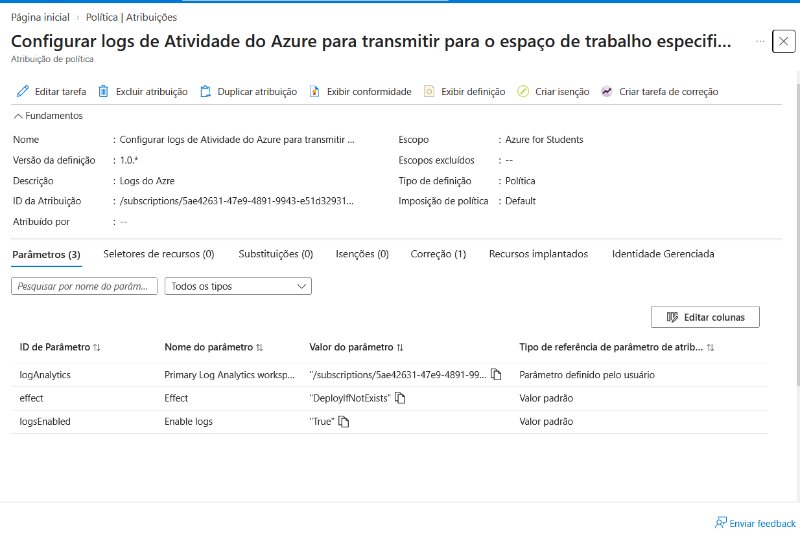
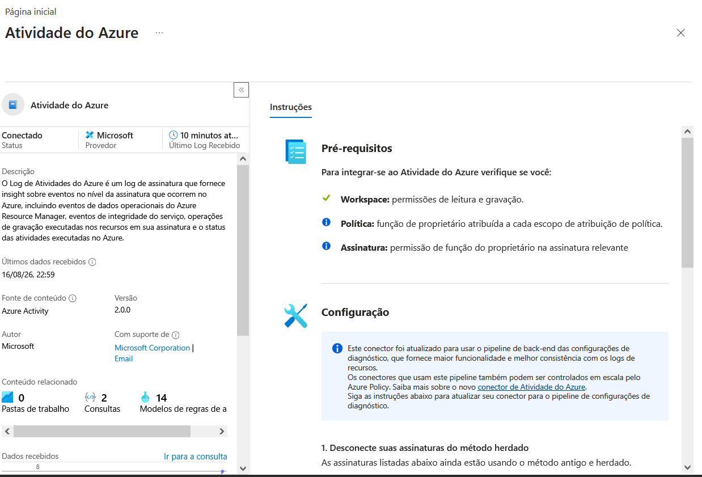
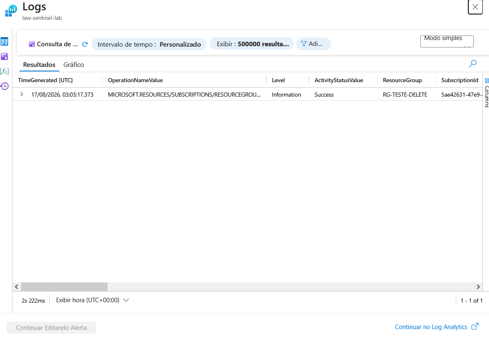
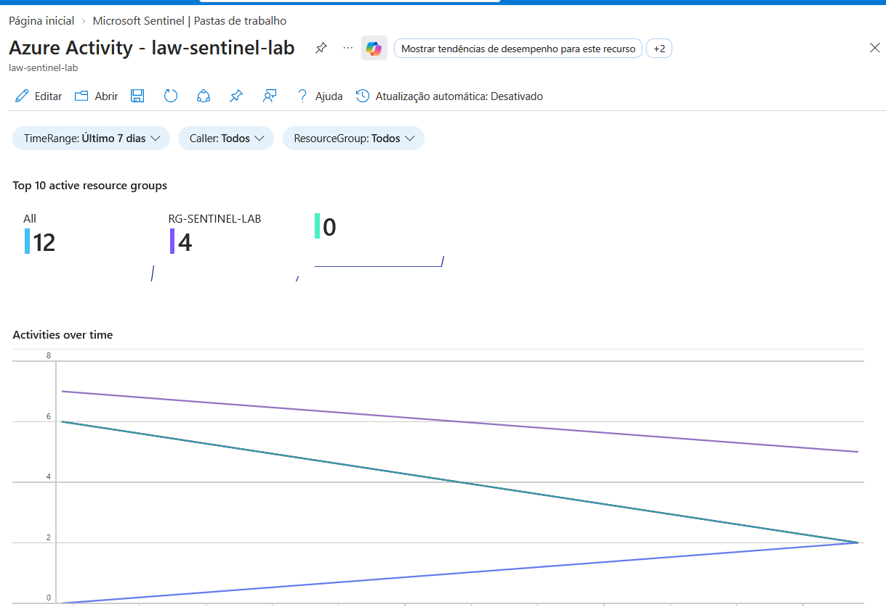

# 🛡️ Laboratório de Microsoft Sentinel — SIEM na prática

Laboratório pessoal de estudo de SIEM/SOC, construído na conta Azure for Students. O objetivo foi passar pelo ciclo completo de um SIEM: provisionamento → ingestão de logs → detecção → teste da detecção → visualização — documentando também os problemas reais encontrados no caminho (e não só o "final feliz").

## 🎯 Objetivo do laboratório

- Provisionar um workspace de Log Analytics e habilitar o Microsoft Sentinel
- Conectar uma fonte de dados real (Azure Activity Log) via Azure Policy
- Escrever queries KQL para exploração de logs
- Criar uma Analytics Rule de detecção e validar sua lógica com um evento real
- Construir um Workbook de visualização
- Gerenciar tudo dentro dos limites de custo de uma conta de estudante

## 🏗️ Arquitetura do laboratório

```
Assinatura Azure for Students
        │
        ▼
  Resource Group (rg-sentinel-lab)
        │
        ▼
  Log Analytics Workspace (law-sentinel-lab)
        │
        ▼
  Microsoft Sentinel habilitado
        │
        ├── Conector: Azure Activity (via Azure Policy - DeployIfNotExists)
        ├── Analytics Rule: "Exclusão de recurso na assinatura" (Severidade Média, MITRE: Impact)
        └── Workbook: Azure Activity (Top resource groups, atividades ao longo do tempo)
```

## 🔍 O que foi feito

### 1. Provisionamento do ambiente
- Criação do Resource Group `rg-sentinel-lab`
- Criação do Log Analytics Workspace `law-sentinel-lab`
- Habilitação do Microsoft Sentinel sobre o workspace
- Configuração de um alerta de orçamento no Cost Management, para acompanhar o consumo do crédito de estudante

### 2. Ingestão de dados — conector Azure Activity
O conector Azure Activity não fica ativo apenas ao ser "instalado" pelo Hub de Conteúdo — foi necessário configurá-lo via um **assistente de atribuição de Azure Policy** (efeito `DeployIfNotExists`), que cria a configuração de diagnóstico responsável por enviar os logs da assinatura para o workspace.

**Problema encontrado:** na primeira tentativa, o escopo da política foi definido incorretamente no nível do Resource Group (`rg-sentinel-lab`) em vez da assinatura inteira. Como o Log de Atividades é um recurso em nível de assinatura, a política nunca encontrou um recurso aplicável (indicador: "0 de 0" recursos na tela de Conformidade).



**Solução:** as atribuições incorretas foram excluídas e uma nova atribuição foi criada com o escopo correto (a assinatura `Azure for Students` inteira). Após rodar a tarefa de correção, o conector passou a mostrar status **Conectado**, com dados fluindo para o workspace.




### 3. Investigação com KQL
Exploração inicial dos dados ingeridos — veja a pasta [`kql-queries/`](./kql-queries):

```kql
AzureActivity
| project TimeGenerated, OperationNameValue, Caller, ActivityStatusValue
```

Um detalhe interessante observado: os primeiros eventos ingeridos foram os próprios logs de criação da configuração de diagnóstico (`DIAGNOSTICSETTINGS/WRITE`, `POLICIES/DEPLOYIFNOTEXISTS`) — ou seja, o processo de configurar o pipeline de ingestão já virou dado dentro do próprio Sentinel.

### 4. Detecção — Analytics Rule
Regra criada para identificar exclusão de resource groups na assinatura:

```kql
AzureActivity
| where OperationNameValue == "MICROSOFT.RESOURCES/SUBSCRIPTIONS/RESOURCEGROUPS/DELETE"
| where ActivityStatusValue == "Success"
```

- **Severidade:** Média
- **Tática MITRE ATT&CK:** Impact
- **Agendamento:** a cada 1 hora
- **Limite de alerta:** maior que 0 resultados

**Validação:** foi criado um resource group descartável (`rg-teste-delete`), em seguida excluído propositalmente. O log da exclusão foi localizado em Logs, confirmando que os campos (`OperationNameValue`, `ActivityStatusValue`) batiam exatamente com a lógica da regra — validando a detecção antes mesmo da execução do ciclo agendado.



### 5. Workbook
Pasta de trabalho baseada no modelo "Azure Activity", exibindo os top resource groups ativos e o volume de atividades ao longo do tempo, filtrável por período, autor (Caller) e resource group.



## 🖼️ Evidências

Veja a pasta [`screenshots/`](./screenshots) para prints de cada etapa: workspace, conector conectado, regra de análise, teste de detecção e workbook.

## 📚 O que aprendi

- Como o Sentinel se relaciona com o Log Analytics Workspace, e que "instalar" um conector no Hub de Conteúdo não é o mesmo que conectá-lo de fato
- Diferença entre escopo de recurso, resource group e assinatura na Azure Policy — e por que isso importa para logs em nível de assinatura
- Estrutura básica de uma query KQL (`where`, `project`, `summarize`)
- Como validar a lógica de uma Analytics Rule antes de depender do agendamento automático
- Cuidados de custo em um ambiente de créditos limitados (Azure for Students): quais recursos geram custo por volume de dados (workspace, Sentinel) versus por tempo de execução (VMs) — e por que nada neste lab, até aqui, exigiu ser "desligado"

## 🛠️ Tecnologias

`Microsoft Sentinel` `Azure Log Analytics` `Azure Policy` `KQL` `Azure Portal`

---
📌 Laboratório construído para fins de estudo, como parte da minha preparação para atuar como Analista de Cybersecurity (SOC).
